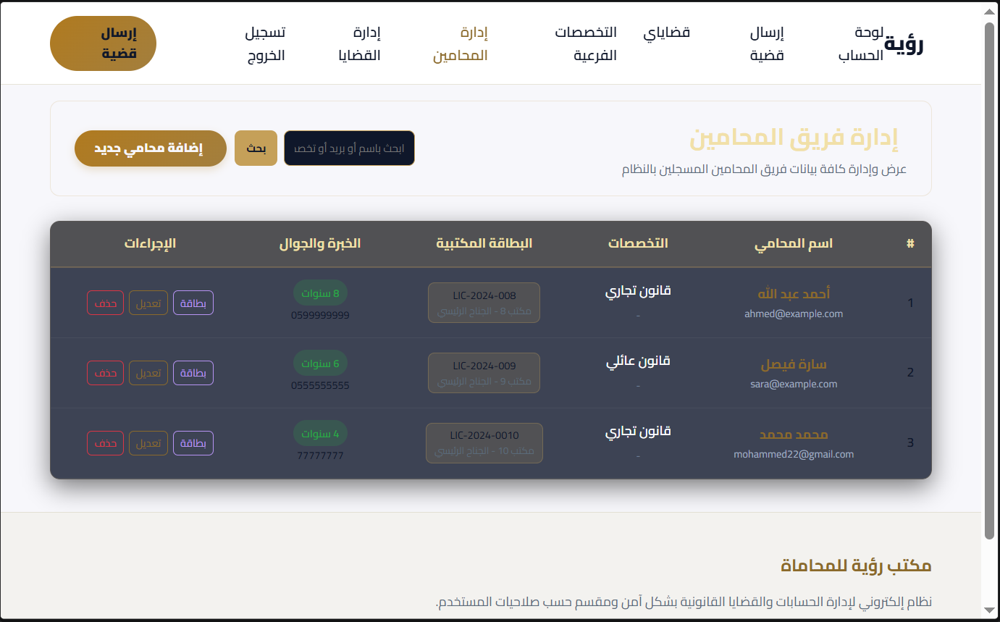
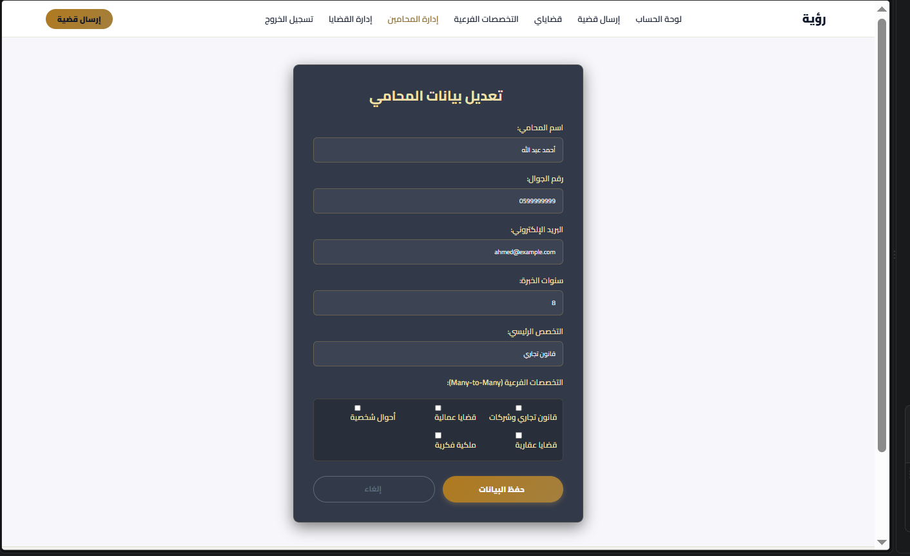
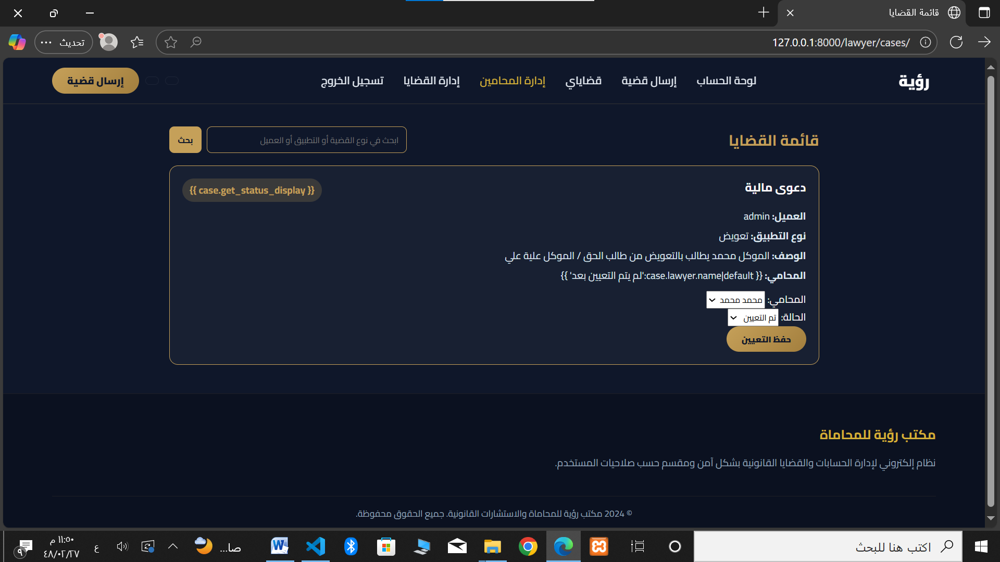

<div dir="rtl" align="center">

# Vision Law Office

### منصة ويب لإدارة مكتب محاماة وخدماته القانونية

إدارة المحامين والقضايا وطلبات العملاء من مكان واحد، مع صفحات تعريفية للمكتب وأمثلة عملية على إمكانات Django ORM.

<p>
  
  
  
  
</p>

<p>
  <a href="#screenshots">استكشف الواجهات</a> ·
  <a href="#features">المزايا</a> ·
  <a href="#getting-started">تشغيل المشروع</a>
</p>

</div>

---

## عن المشروع

**Vision Law Office** تطبيق ويب مبني باستخدام Django لمكتب محاماة. يجمع بين الواجهة التعريفية للمكتب وأدوات إدارة المحامين والخدمات والقضايا، ويوفر حسابات للعملاء ولوحة متابعة للطلبات. يتضمن المشروع كذلك تطبيقات تعليمية لعلاقات قواعد البيانات ودوال `QuerySet` ونماذج Django.

<a id="screenshots"></a>
## لقطات من المشروع

<div align="center">
  
  
  <br>
  
  
</div>

<a id="features"></a>
## المزايا

| المجال | الوظائف |
| --- | --- |
| الحسابات | إنشاء حساب، تسجيل الدخول والخروج، الملف الشخصي ولوحة العميل |
| المحامون | عرض وبحث، تفاصيل المحامي، وإضافة البيانات وتعديلها وحذفها للمشرف |
| القضايا | إرسال طلب قضية، تعيين محامٍ، ومتابعة حالة الطلب |
| التواصل | استقبال رسائل العملاء وإدارة الردود |
| الخدمات والفروع | عرض الخدمات القانونية ومعلومات المكتب والفروع |
| العلاقات | تطبيق علاقات `One-to-One` و`Many-to-Many` و`ForeignKey` |
| تطبيقات Django | أمثلة عملية على `filter` و`exclude` و`select_related` و`prefetch_related` و`annotate` و`aggregate` وغيرها |

## التقنيات

- Python 3.12 أو أحدث
- Django 6
- PostgreSQL
- HTML وCSS وقوالب Django

<a id="getting-started"></a>
## تشغيل المشروع

### المتطلبات

- Python 3.12 أو أحدث
- PostgreSQL وقاعدة بيانات فارغة للمشروع

### الإعداد

1. استنسخ المستودع وانتقل إلى مجلده:

   ```bash
   git clone <رابط-المستودع>
   cd lawyer-office-hw4
   ```

2. أنشئ بيئة افتراضية وفعّلها:

   ```bash
   python -m venv .venv
   ```

   على Windows PowerShell:

   ```powershell
   .\.venv\Scripts\Activate.ps1
   ```

   على macOS أو Linux:

   ```bash
   source .venv/bin/activate
   ```

3. ثبّت الاعتماديات، بما فيها حزم PostgreSQL والصور وإعدادات البيئة:

   ```bash
   python -m pip install -r requirements.txt python-dotenv "psycopg[binary]" Pillow
   ```

4. أنشئ قاعدة بيانات PostgreSQL، ثم أضف ملف `.env` في جذر المشروع:

   ```dotenv
   DB_NAME=lawyer_office
   DB_USER=postgres
   DB_PASSWORD=*******
   DB_HOST=127.0.0.1
   DB_PORT=****

   ```


5. طبّق ترحيلات قاعدة البيانات وأنشئ حساب مشرف:

   ```bash
   python manage.py migrate
   python manage.py createsuperuser
   ```

6. شغّل خادم التطوير:

   ```bash
   python manage.py runserver
   ```

   افتح [http://127.0.0.1:8000/](http://127.0.0.1:8000/) في المتصفح.

## مسارات مفيدة

| المسار | الصفحة |
| --- | --- |
| `/` | الحسابات وتسجيل الدخول |
| `/lawyer/` | واجهة مكتب المحاماة |
| `/lawyer/lawyers/` | دليل المحامين |
| `/lawyer/cases/` | إدارة طلبات القضايا |
| `/lawyer/homework/queryset/` | أمثلة دوال QuerySet |
| `/lawyer/homework/forms/` | أمثلة النماذج |
| `/admin/` | لوحة إدارة Django |

## الاختبارات

```bash
python manage.py test
```


<div align="center" dir="rtl">
  مشروع تعليمي لإدارة مكتب محاماة باستخدام Django
</div>
